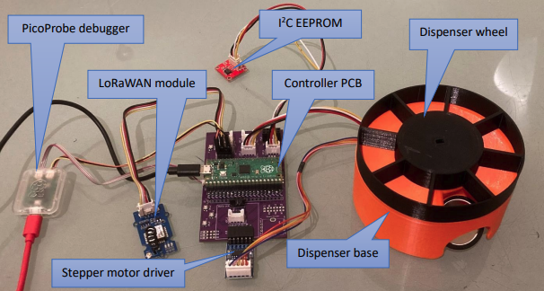

# Automated Pill Dispenser System

**Authors:** Aleksanteri Merilainen, Denis Kononov, Nadim Ahmed  
**Date:** January 15, 2024

## Abstract

The Automated Pill Dispenser System, utilizing a Raspberry Pi Pico W, is intended to dispense daily medication to patients with high precision and reliability. This system uses sensor data to dispense pills on a scheduled basis, aiding patients in their medication management. Its design focuses on accuracy, user-friendliness, and consistency in operation.

## Introduction

This document provides an overview of the Automated Pill Dispenser System, a project designed to automate the process of medication management.

## Project Overview

The Automated Pill Dispenser System, an embedded project, uses a Raspberry Pi Pico W to automate medication dispensing. It includes a precisely calibrated dispensing mechanism, non-volatile memory to preserve operational data, and LoRaWAN for remote status updates. The system is rigorously tested to reliably dispense accurate medication doses and maintain dispensing records, even during power outages.

### Component Overview

The system consists of the following components:

- **Raspberry Pi Pico WH**: Raspberry Pi Pico is a low-cost, high-performance microcontroller board with flexible digital interfaces. This microcontroller controls operations, manages sensors and data and drives the motor for pill distribution.

- **Raspberry Pi Debug Probe**: The Raspberry Pi Debug Probe is a USB device that provides both a UART serial port and a standard Arm Serial Wire Debug (SWD) interface. The probe is designed for easy, solderless, plug-and-play debugging. It proved very useful in the development stage, helping us ensure that the software and hardware communicate as expected.

- **Grove LoRa-E5 (LoRaWAN Module)**: The Grove LoRa-E5 is a wireless radio module designed to support both LoRa and LoRaWAN protocols. It allows for long-range and low-power communication. This module establishes a connection to the processing environment through a UART (Universal Asynchronous Receiver-Transmitter) connection. It plays a crucial role in transmitting the current state of the dispenser and essential information over the LoRaWAN network, enabling remote monitoring and control.

- **I2C EEPROM - Crowtail**: Electronically Erasable Programmable Read-Only Memory (EEPROM) is non-volatile memory that allows for values to be written and stored for long periods of time while using very little power. It is modifiable, meaning that data can be both written and erased. The Crowtail - I2C EEPROM is 256k bits which gives us plenty of room to store program states and logs while ensuring data is preserved over power interruptions.

- **Stepper Motor**: The pill dispenser's base consists of the base and the wheel. The base houses the stepper motor, optical sensor, and piezoelectric sensor. The plastic base features an opening for pill dispensing, with the piezo sensor located at the bottom to detect pill drops. The wheel connects to the base through the stepper motor shaft and includes an optical sensor known as the opto fork. The wheel is divided into eight compartments, one for calibration and seven for storing medication.

#### Stepper Motor Type
The project utilizes a 28BYJ-48 stepper motor, which is a 5-wire unipolar motor with four coils. It is controlled through a stepper motor driver, enabling precise rotation of the dispenser wheel. The motor driver used in this project is the Elecrow ULN2003 Stepper Motor Driver. This driver is connected to the processing environment, ensuring accurate and controlled movement of the dispenser's wheel.

#### Half-Stepping Mechanism
To achieve greater precision in controlling the stepper motor, the project employs a half-stepping mechanism. This technique allows for finer increments in the motor's rotation, enhancing the accuracy of the pill dispenser's operation.

### Sensor Integration

The Automated Pill Dispenser System incorporates two key types of sensors, each playing a vital role in its operation:

- **Optical Sensor**: The system uses an optical fork sensor located in the base of the pill dispenser. This sensor consists of two parallel arms forming a "fork" structure, where one arm emits light beams, and the other detects interruptions in these beams. In our project, this sensor is crucial for detecting the calibration opening on the dispensing wheel, facilitating precise wheel calibration and ensuring accurate pill dispensation.

- **Piezoelectric Sensor**: Positioned at the bottom of the dispensing opening, the piezoelectric sensor uses the piezoelectric effect to measure changes in pressure, acceleration, temperature, strain, or force such as a dropping pill by converting them to an electrical charge. This sensor is essential for verifying the successful release of medication, providing real-time feedback on the dispenser’s operation and enhancing the reliability of the dispensing process.

## Implementation

The implementation of the Automated Pill Dispenser System required integrating hardware assembly and microcontroller programming to achieve error-resilient operation. The system was designed to meet both minimum and advanced requirements.

### Minimum Requirements Achievement

The system starts with an initial state where it waits for a user button press. An LED indicator blinks to signal readiness for calibration. Upon pressing a button, the system starts a calibration sequence where the dispenser wheel turns three full revolutions to align the compartment with the sensor opening with the drop tube. This alignment ensures accurate pill dispensing.

After calibration, the system enters a standby mode. Another button press triggers the dispensing action. The dispenser then releases pills at 30-second intervals, a modification from the daily schedule for testing purposes. The piezo sensor confirms the successful dispensation of the pill. Should the sensor fail to detect a pill, the LED blinks five times to notify of the error. This process repeats until all seven compartments have been emptied, at which point the system resets to the initial state, ready for a new cycle.

### Advanced Requirements Achievement

Advanced requirements focused on remote communication and ensuring the system's functionality even after power interruptions or resets. The device's state, including the number of pills dispensed and logs of dispensing activities, is stored in non-volatile memory using an I2C EEPROM. This allows the system to retain critical information and resume operations after a reboot.

The device is equipped with LoRaWAN connectivity, enabling it to report its state changes, such as booting up, pill dispensing events, and errors, to a remote server. This feature allows for caregivers to monitor patient's medication schedule remotely.

The system can detect and recover from power interruptions during operation. If a power failure occurs while the motor is turning, the device is capable of recalibrating automatically after power is restored. It resumes the dispensing process without releasing any additional pills, maintaining the correct medication dispensing schedule.

### Reliability and Error Management

A watchdog timer provides robust system reliability, resetting the dispenser in the event of a freeze. Error handlers address dispensing discrepancies, while ISRs (Interrupt Service Routines) manage real-time system triggers. EEPROM persistence guarantees operational continuity post-reboot.

## Bibliography

1. [Raspberry Pi Pico Documentation](https://www.raspberrypi.com/documentation/microcontrollers/raspberry-pi-pico.html).
2. [Raspberry Pi Debug Probe Documentation](https://www.raspberrypi.com/documentation/microcontrollers/debug-probe.html).
3. [Crowtail - I2C EEPROM](https://www.elecrow.com/wiki/index.php?title=Crowtail-_I2C_EEPROM#Description).
4. [LoRa - Seed Studio](https://www.seeedstudio.com/Grove-LoRa-E5-STM32WLE5JC-p-4867.html).
5. [ULN2003 Stepper Motor Driver](https://lastminuteengineers.com/28byj48-stepper-motor-arduino-tutorial/).
6. [Piezoelectric sensor - Wikipedia](https://en.wikipedia.org/wiki/Piezoelectric_sensor).

